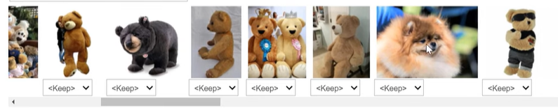
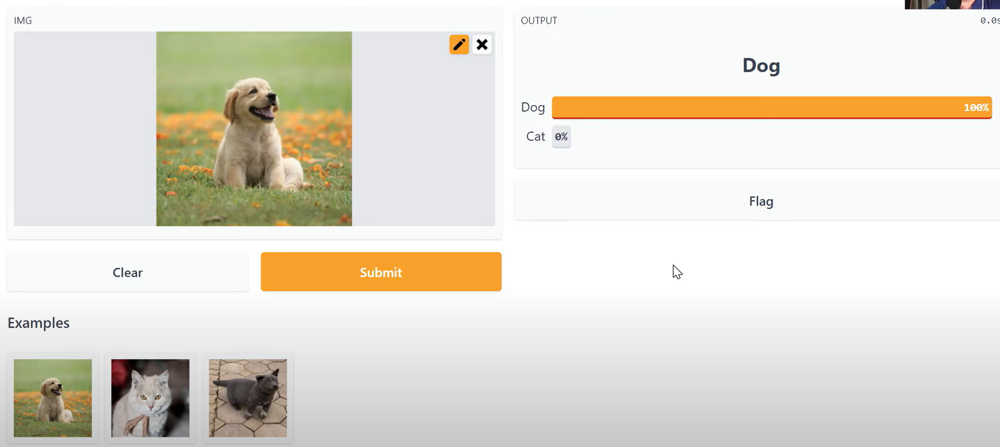

# 2. Deployment

## Keyword
> ___data cleaning with fast.ai___

> ___hugging face___

> ___Gradio___

## About Lecture

* __Jupyter notebook TIPS__  :  ___jupyter_contirb_extension___
    * navigate menu -> Searchable like a table of contents    
    * collabsible headings -> toggle
    * enter ??? in front of the function -> you can get full code -> fast.ai, pytorch ect
    * nbconvert : ` jupyter nbconvert --to script my_notebook.ipynb`

<br/>

* __Train model before Data Cleaning !__
    *  by training, we can plot top losses
        *  tell us places where the loss is the highest
        bad loss == being wrong and confident or being right and unconfident

    * fast.ai imageClassifierCleaner
    
        * clean up the ones tha are wrongly labeld in our dataset
        * orderd by loss == ordered by confidence
        * we can modify label using gui tool
        * modify train/validation sets are available  

    ___=> build model before data cleaning so that we can filter strange data___ 
    ___=> we can decide how to collect dataset next time___  
    ___=> we can find how to automate data cleaning___  
    
<br/>

* __RandomResizedCrop is better than Resize__
    * Effectiveness has been demontrated in studies on German and Spanish text image classification
    * train many different ways by one Image(augmentation)

<br/>

* __hugging face with Gradio__

    * gr make simple web demo that can inference input with our model
    * if we made app.py with gradio, then push it on hugging face( silmilar to github ) -> we can check our model demo!
    ```python
    import gradio as gr

    def greet(name) : return f"Hello {name}"

    gr.Interface(fn = classify_img , input = "image", output="label", examples=examples).launch()
    ```
    

## Questions
* what is ddg ?
* how to automate data cleaning ?
---
[code](https://www.kaggle.com/code/jhoward/saving-a-basic-fastai-model/notebook)
