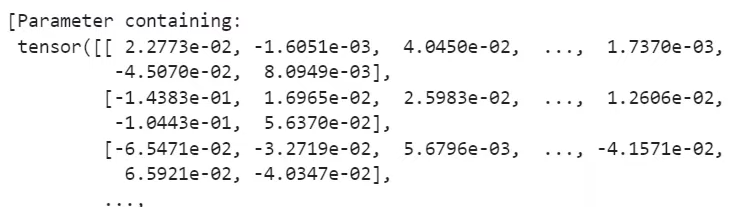

# 3_Neural_net_foudations
3강 Stochastic gradient descent (SGD)랑 ReLU 작동 원리 ,  non-linear activation functions 키워드 위주로 듣고 인사이트랑 질문거리 있으면 적어보자
## Keywords

## About Lecture
28:40부터
## Questions

ai lesson 듣는 법
watch lecture -> reun notebook & experiment 
reoroduce results
repeat with different datset

fastbook rep -> clean folder -> same code but without text and ouput logs -> use it when you practice 

금주 소식 : 
- 가위바위보 사진 가지고 가위바위보 하는 게임
- predict the avr temp of an area based on an aerial photograph
- music genre classification
- art movement classifire

새로운 플랫폼 소개:
* paperspace : kaggle/google과 유사
* Gradient라는 노트북 사용
* 이 수업에 최적화된 플랫폼이라 생각!
* 차별점 : 실제 컴퓨터다. kaggle, colab처럼 가상 환경이 아님.
* 영구 스토리지 제공. 다음에 켜도 파일 유지됨

저번 강의의 핵심:
* train model
* model.pkl file

전체 프로세스
* timm 라이브러리 install -> image관련 모델 불러오기
* 모델 학습 및 결과 추출 
* graidio 이용해 launch

learner의 주요 기능
1. list of pre processing stpes that turn our imges into things of the model 
2. train model   
=> you can actually grab the trained model by grabbing the .model attribute  
`m = learn.model`

pytorch의 get_submodle:  

* ex) 0.model.stem.1 == return parameters of LayerNorm2d (mouse point)

=> what are these numbers?

---
[code](https://www.kaggle.com/code/jhoward/how-does-a-neural-net-really-work)

